<h2 align="center"> Hyper-V Virtualization-Based System and Network Management Lab</h2>

-Bu projemde Hyper-V sanallaştırma platformunu kullanarak Windows 11 sanal makinesi kurdum. Kurulum sürecinde sanal makine oluşturma, disk işlemleri, checkpoint yapısı (VMware tarafındaki snapshot mantığı), export/import işlemleri ve network tipleri gibi birçok konuda uygulamalı çalışma yapma fırsatı buldum.Aynı zamanda converter araçlarını da kullanarak öğrendiğim bilgileri pratiğe döktüğüm bir çalışma oldu. Bu proje sayesinde sanallaştırma tarafında öğrendiklerimi uyguladım.
 
-In this project, I created a Windows 11 virtual machine using the Hyper-V virtualization platform. During the setup process, I had the opportunity to work practically on many topics such as virtual machine creation, disk management, checkpoints (similar to the snapshot structure in VMware), export/import operations, and different network types.At the same time, this project allowed me to apply the knowledge I learned about converter tools in practice. Thanks to this project, I was able to put my virtualization knowledge into practice.

<h2>Virtual Machine Settings (Sanal Makine Ayarları)</h2>

<table>
  <tr>
    <td align="center" width="33%">
      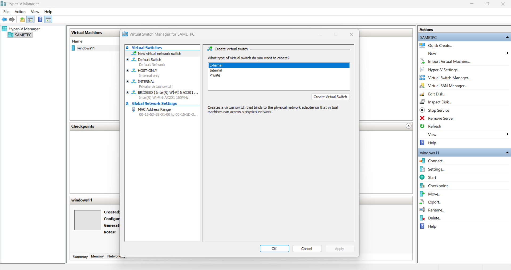
       <b>1 — Virtual Switch Manager</b>
    </td>
    <td align="center" width="33%">
      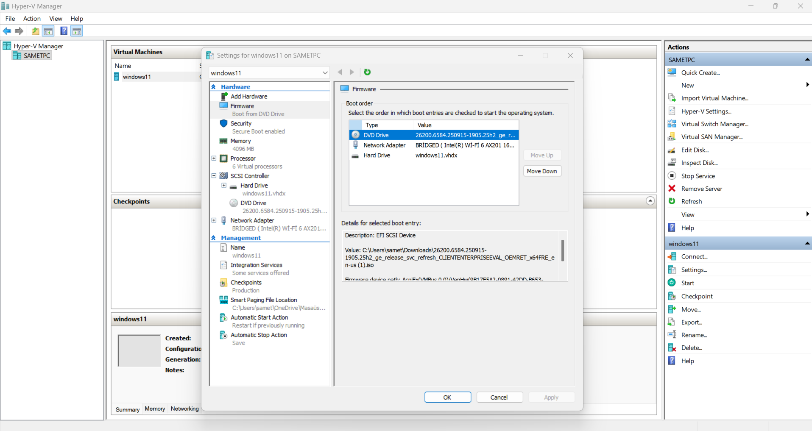
       <b>2 — VM General Settings</b>
    </td>
    <td align="center" width="33%">
      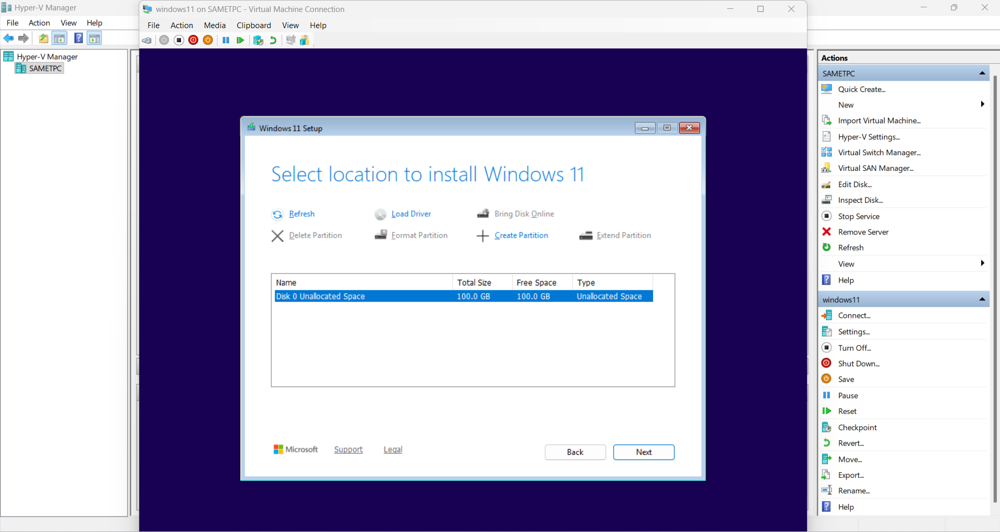
       <b>3 — VM Disk Configuration</b>
    </td>
  </tr>
</table>

 

-İlk görselde Hyper-V platformunda network ayarlarımı ve isimlendirmeleri yaptım. Burada yaptığım ayarlara göre kuracağım sanal makinelerde belirlediğim network yapılarını kullanacağım. Bu sayede sanal makineler arasında daha düzenli ve kontrollü bir ağ yapısı oluşturmuş oldum.İkinci görselde ise sanal makinemin genel ayarları bulunuyor. İşletim sistemini ISO dosyası ile kuracağım için boot order kısmında ISO'yu en üste aldım. Sanal makineye başlangıç olarak 4 GB RAM, 100 GB disk alanı ve 6 sanal işlemci tanımladım. Bu kaynaklar kurduğum sistem için yeterli seviyede oldu.Network tarafında ise daha önce oluşturduğum bridged network yapısını kullanacağım. Bu sayede sanal makinem hem diğer sanal makinelerle hem host sistemle hem de hostun bağlı olduğu LAN ağıyla iletişim kurabilecek.Ayrıca Integration Services kısmında işletim sistemini daha stabil, performanslı ve verimli kullanabilmek için gerekli ayarlamaları da aktif hale getirdim.Üçüncü görselde ise işletim sistemi kurulumu sırasında kullandığım diskin boyutunu ve isimlendirmesini görebilirsiniz. Bu aşamada sanal makine için ayırdığım disk yapısını kontrol ederek kurulumu bu disk üzerinden devam ettirdim.

  

-In the first screenshot, I configured the network settings and naming structure on the Hyper-V platform. Based on these settings, I will use the network configurations I created for the virtual machines that I set up later. This helped me create a more organized and controlled network structure between virtual machines.In the second screenshot, you can see the general settings of my virtual machine. Since I will install the operating system using an ISO file, I moved the ISO to the top of the boot order. I assigned 4 GB of RAM, 100 GB of disk space, and 6 virtual processors to the virtual machine. These resources were sufficient for the system I planned to use.On the network side, I will use the bridged network configuration that I created earlier. This allows the virtual machine to communicate with other virtual machines, the host system, and the host's LAN network.Additionally, I enabled the necessary Integration Services settings to make the operating system more stable, efficient, and performant.In the third screenshot, you can see the disk size and naming configuration used during the operating system installation. At this stage, I checked the disk structure allocated for the virtual machine and continued the installation process on this disk.

---

<h2>Disk Adding And Expanding (Disk Ekleme Ve Genişletme)</h2>

<table>
  <tr>
    <td align="center" width="50%">
      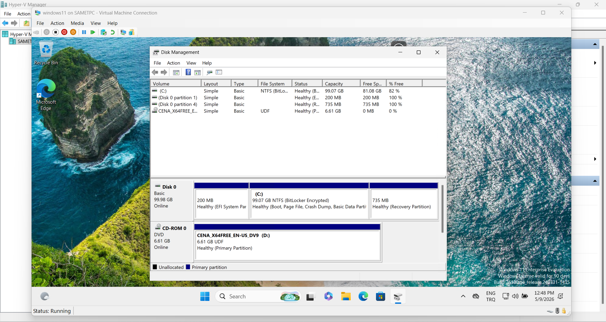
       <b>Before / Önce</b>
    </td>
    <td align="center" width="50%">
      
       <b>After / Sonra</b>
    </td>
  </tr>
</table>

 

-Projede sanal makine üzerinde disk genişletme ve yeni disk ekleme işlemleri gerçekleştirdim.İlk görselde diskin işlem yapılmadan önceki hali yer almaktadır. İkinci görselde ise mevcut diski 30 GB genişlettim. Bu işlemi yapma sebebim, disk alanının yetersiz kalması ve aynı disk üzerinde çalışmaya devam edecek olmamdı.Daha sonra sisteme 50 GB boyutunda yeni bir disk ekledim. Bu diski farklı verileri depolamak için kullanarak ana sistem diskinde oluşabilecek doluluk sorunlarının önüne geçmeyi hedefledim.

  

-In this project, I performed disk extension and new disk addition operations on a virtual machine.In the first image, the disk is shown before any modifications. In the second image, I extended the existing disk by 30 GB due to insufficient storage space. Since I needed to continue working on the same disk, extending it was the most appropriate solution.After that, I added a new 50 GB disk to the system. I used this disk to store different types of data, aiming to prevent the main system disk from running out of space.

---

<h2>Checkpoints</h2>

<table>
  <tr>
    <td align="center" width="50%">
      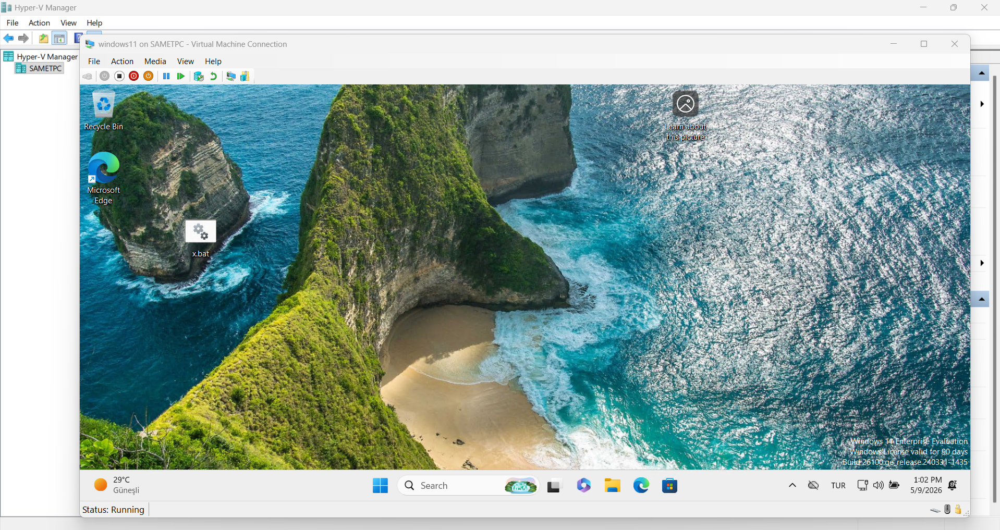
       <b>1 — Stable State / Kararlı Durum</b>
    </td>
    <td align="center" width="50%">
      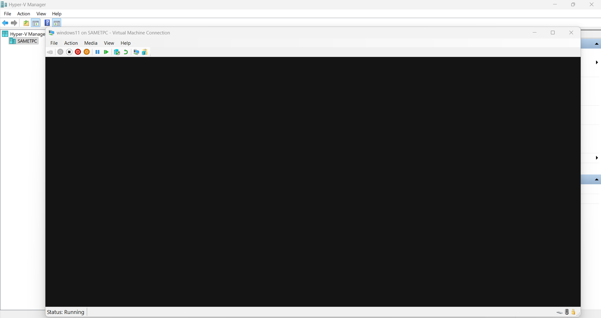
       <b>2 — Black Screen Error / Siyah Ekran Hatası</b>
    </td>
  </tr>
  <tr>
    <td align="center" width="50%">
      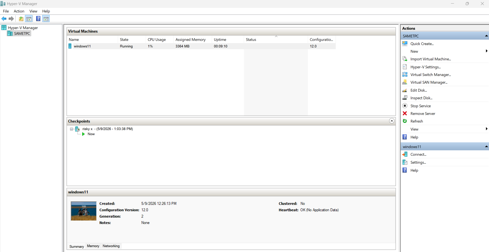
       <b>3 — Checkpoint Manager</b>
    </td>
    <td align="center" width="50%">
      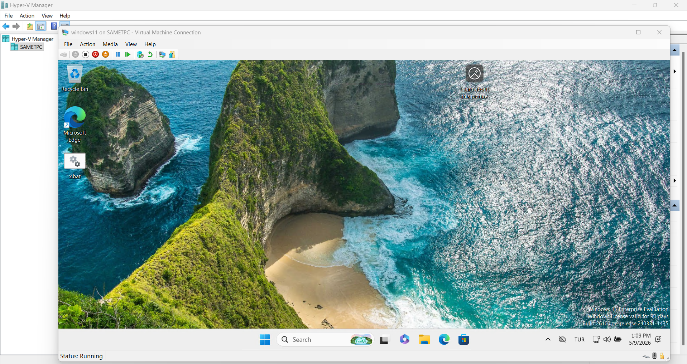
       <b>4 — Restored State / Geri Yükleme</b>
    </td>
  </tr>
</table>

 

-Bu projede, sistem üzerinde yapılacak riskli işlemler öncesinde checkpoint kullanımını test ettim. İlk görselde, herhangi bir işlem yapılmadan önce sorunsuz ve stabil çalışan sistemin checkpoint'ini aldım. Daha sonrasında sistem üzerinde şüpheli bir işlem gerçekleştirdim ve ikinci görselde görüldüğü gibi bu işlem sonucunda sistemde siyah ekran hatası oluştu. Bu durum farklı sistem hataları şeklinde de ortaya çıkabilirdi.Bu hata sonrasında Hyper-V checkpoints arayüzü üzerinden daha önce aldığım checkpoint'e geri dönerek sistemi kısa sürede eski ve sorunsuz haline getirdim. Bu sayede checkpoint yapısının, hatalı veya riskli işlemler sonrasında sistemi hızlıca geri yüklemek için oldukça etkili bir kurtarma yöntemi olduğunu uygulamalı şekilde görmüş oldum.Ayrıca bu projede Standard Checkpoint ve Production Checkpoint arasındaki farkları da inceleme fırsatı buldum. Production Checkpoint, VSS (Volume Shadow Copy Service) desteği sayesinde checkpoint alınacağı zaman desteklenen uygulamalara verilerini diske kaydetmesi için bildirim gönderir ve daha tutarlı bir yedekleme yapısı oluşturur. Desteklenmeyen veriler ise kaydedilmez.Standard Checkpoint tarafında ise sanal makine, checkpoint alındığı andaki haliyle tamamen geri yüklenebilir. Buna RAM üzerindeki veriler de dahildir. Bu yüzden iki checkpoint türünün kullanım amacı ve zamanlaması oldukça önemlidir.

  

-In this project, I tested checkpoint usage before performing risky operations on the system. In the first screenshot, I created a checkpoint of the system while it was running smoothly and stably before making any changes. Later, I performed a suspicious operation on the system, and as shown in the second screenshot, this caused a black screen error. Similar unexpected system issues could also occur in different scenarios.After this issue, I restored the system to its previous stable state by reverting to the checkpoint I had created earlier through the Hyper-V checkpoints interface. This allowed me to practically observe how effective checkpoints are as a recovery method after risky or faulty operations.I also had the opportunity to examine the differences between Standard Checkpoint and Production Checkpoint. Production Checkpoint supports VSS (Volume Shadow Copy Service), which notifies supported applications to save their data to disk before the checkpoint is taken, creating a more consistent backup structure. Unsupported data may not be saved during this process.On the other hand, Standard Checkpoint restores the virtual machine exactly as it was at the moment the checkpoint was taken, including the data stored in RAM. Because of this, understanding the purpose and correct timing of both checkpoint types is very important.

---

<h2>Virtual Machine Export And İmport (Sanal Makine Dışa Aktarma ve İçeri Aktarma)</h2>

<table>
  <tr>
    <td align="center" width="50%">
      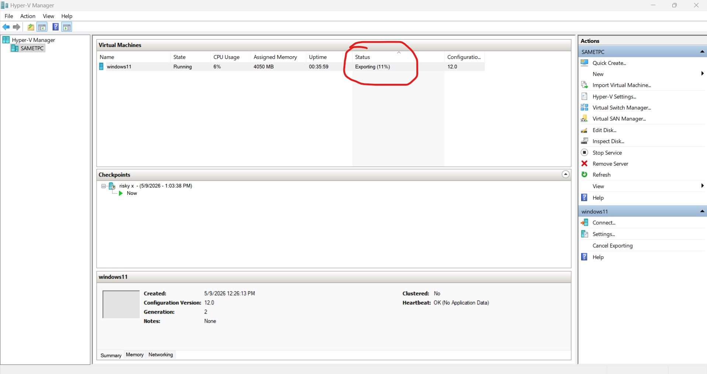
       <b>Export — Step 1 / Adım 1</b>
    </td>
    <td align="center" width="50%">
      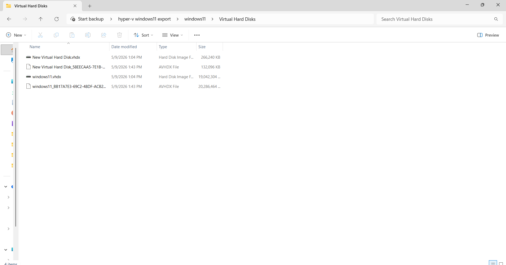
       <b>Export — Step 2 / Adım 2</b>
    </td>
  </tr>
  <tr>
    <td align="center" width="50%">
      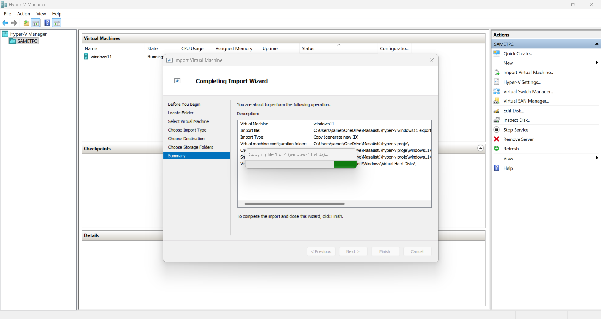
       <b>Import — Step 1 / Adım 1</b>
    </td>
    <td align="center" width="50%">
      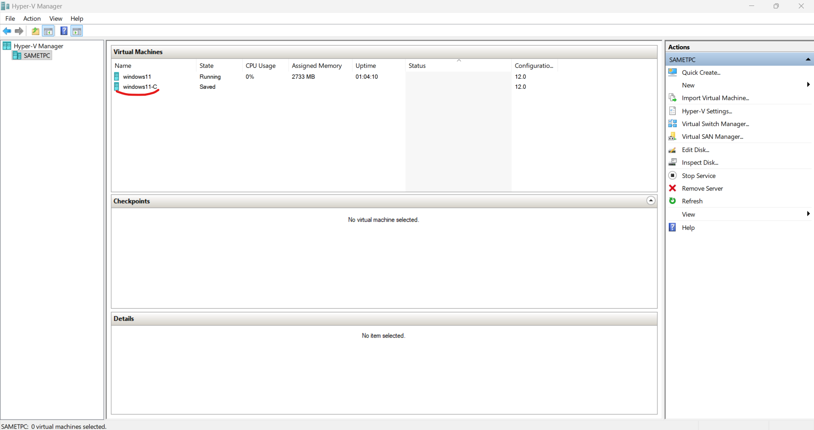
       <b>Import — Step 2 / Adım 2</b>
    </td>
  </tr>
</table>

 

-Bu aşamada, ilk iki görselde export (dışa aktarma), son iki görselde ise import (içe aktarma) işlemlerini gerçekleştirdim.Export işlemini yapmamın amacı, oluşturduğum sanal makineyi farklı platformlara veya ortamlara kolayca taşıyabilmek ve kullanılabilir hale getirmektir. Bu sayede aynı sistemi yeniden kurmaya gerek kalmadan başka ortamlarda da çalıştırmak mümkün olmaktadır.
Import işlemi ise export edilen sanal makinenin farklı bir platforma veya ortama yeniden kurulmasını sağlar. Bu yöntem, sistem taşınabilirliği ve hızlı kurulum açısından büyük avantaj sunar.

  

-At this stage, I performed export operations in the first two images and import operations in the last two images.The purpose of the export process was to make the virtual machine portable across different platforms or environments and ensure it can be reused easily. This allows the same system to run in different environments without the need to rebuild it from scratch.The import process, on the other hand, enables the exported virtual machine to be installed and run on another platform or environment. This approach provides significant advantages in terms of system portability and rapid deployment.

---

<h2>Virtualization Networks (Sanallaştırma Networkleri)</h2>

-Sanallaştırma networkleri, sanal makinelerin (VM), host sistemlerin ve LAN yapılarının birbirleriyle iletişim kurmasını sağlamak için kullanılır. Farklı network türleri ise farklı erişim ve izolasyon seviyeleri sunar. Hyper-V arayüzünde kullanılan temel network tipleri sırasıyla External, Internal ve Private şeklindedir.External network, VMware tarafındaki bridged yapı gibi çalışır. Bu yapı sayesinde sanal makineler hem birbirleriyle hem fiziksel host sistemle hem de hostun bağlı olduğu LAN ağıyla iletişim kurabilir. Bu yüzden internete ve yerel ağa erişim gereken senaryolarda sık kullanılır.Internal network ise VMware'deki host-only mantığına benzer şekilde çalışır. Bu yapıda sanal makineler yalnızca birbirleriyle ve fiziksel host sistemle haberleşebilir. Hostun bağlı olduğu LAN üzerindeki diğer cihazlar bu sanal makinelere erişemez. Bu yapı daha izole ve güvenli test ortamları oluşturmak için tercih edilir.Private network ise VMware'deki internal network mantığını sergiler. Bu yapıda yalnızca sanal makineler birbirleriyle iletişim kurabilir. Fiziksel host sistem veya dış ağ ile herhangi bir bağlantı bulunmaz. Bu nedenle tamamen dış dünyadan bağımsız izole laboratuvar ortamları oluşturmak için kullanılır.
Kolay anlaşılabilirlik açısından oluşturulan networklere bridged, host-only ve internal gibi isimler verilmiştir. Ancak kullanılacak senaryoya göre farklı isimlendirmeler yapmak da mümkündür.

  

-Virtualization networks are used to enable communication between virtual machines (VMs), host systems, and LAN structures. Different network types provide different levels of access and isolation. In the Hyper-V interface, the main network types are External, Internal, and Private.The External network behaves similarly to the bridged network structure in VMware. With this configuration, virtual machines can communicate with each other, the physical host system, and the LAN network connected to the host. Because of this, it is commonly used in scenarios where internet and local network access are required.The Internal network works similarly to VMware's host-only mode. In this structure, virtual machines can communicate only with each other and the physical host system. Devices connected to the host's LAN cannot access these virtual machines. This configuration is preferred for creating more isolated and secure testing environments.The Private network behaves like VMware's internal network structure. In this setup, only virtual machines can communicate with each other. There is no communication with the physical host or external networks. Therefore, it is mainly used for completely isolated lab environments.For easier understanding, these networks were named bridged, host-only, and internal in this project. However, different naming conventions can also be used depending on the scenario.

  

<table>
  <tr>
    <td align="center" width="50%">
      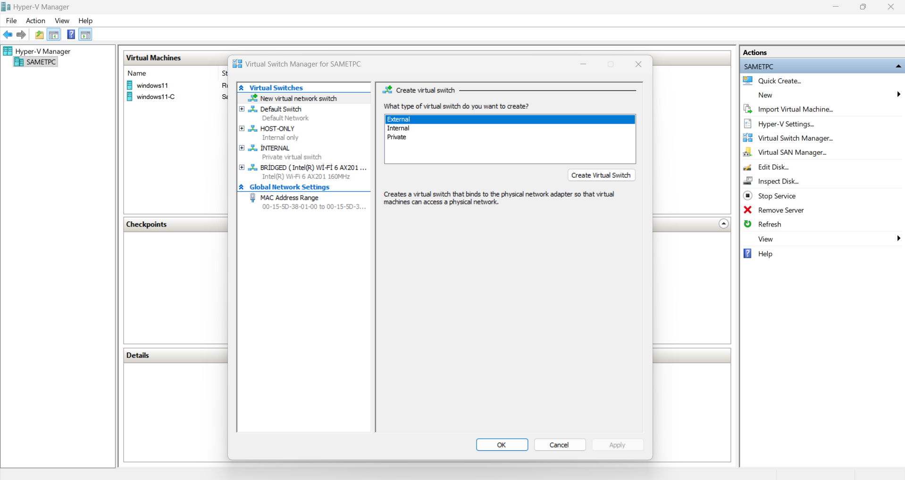
       <b>1 — Virtual Switch Manager / Network Yapıları</b>
    </td>
    <td align="center" width="50%">
      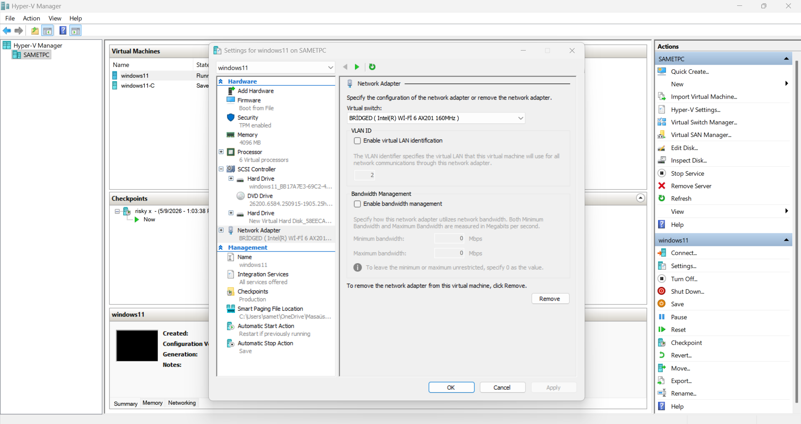
       <b>2 — Bridged Network</b>
    </td>
  </tr>
  <tr>
    <td align="center" width="50%">
      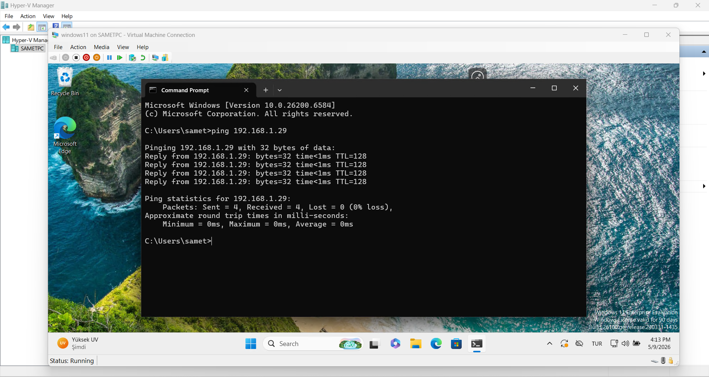
       <b>3 — Ping Test / Bağlantı Doğrulama</b>
    </td>
    <td align="center" width="50%">
      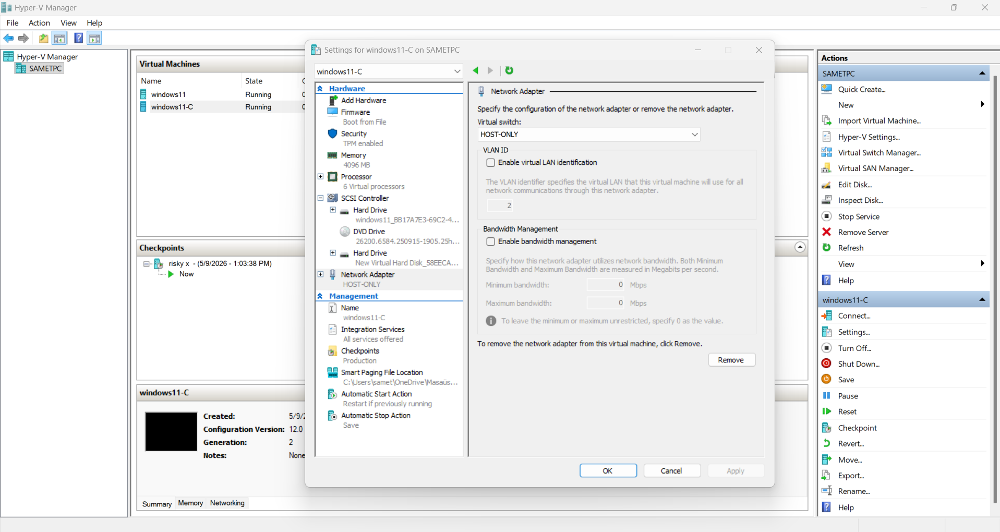
       <b>4 — Host-Only Network</b>
    </td>
  </tr>
  <tr>
    <td align="center" width="50%">
      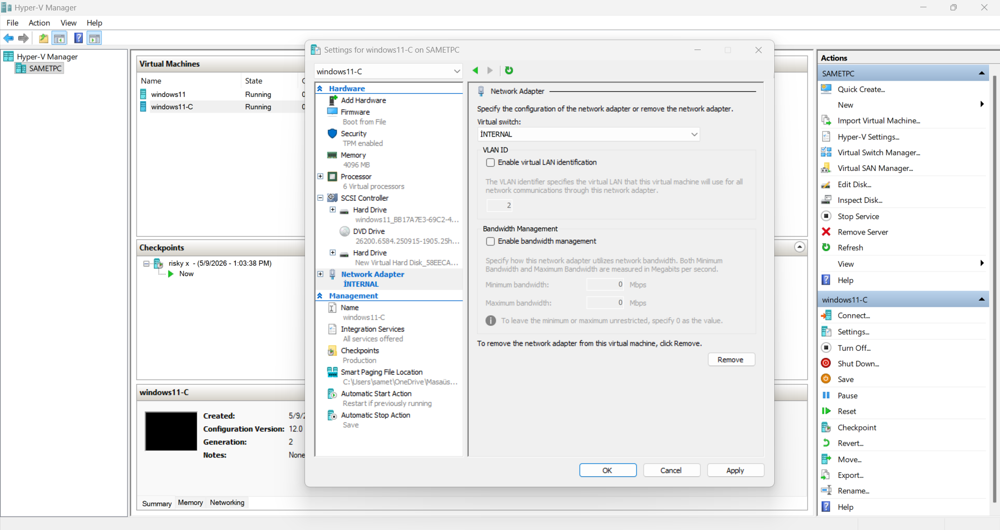
       <b>5 — Internal Network</b>
    </td>
    <td></td>
  </tr>
</table>

 

-İlk görselde, farklı senaryolara göre kendim oluşturduğum network yapılarını ve tercihlerini görebilirsiniz. Her network yapısını kullanım amacına göre ayrı şekilde yapılandırdım.İkinci görselde ise Windows 11 sanal makineme "bridged" olarak isimlendirdiğim network yapısını entegre ettim. Bu sayede sanal makinem hem fiziksel makinemle hem diğer sanal makinelerle hem de fiziksel makinenin bağlı olduğu LAN ağıyla iletişim kurabilecek hale geldi.Üçüncü görselde, yapılandırmanın düzgün çalıştığını kontrol etmek için fiziksel makineme ping testi gerçekleştirdim ve bağlantının başarılı şekilde çalıştığını doğruladım.Eğer sanal makinenin network yapısını dördüncü görseldeki "HOST-ONLY" ismiyle oluşturduğum network olarak ayarlasaydım, iletişim kurulabilmesi için manuel olarak static IP tanımlaması yapmam gerekecekti. Bunun için fiziksel makinede oluşan sanal network adaptörüne verdiğim network ID ile aynı subnet yapısında bir IP adresini sanal makineye tanımlayarak haberleşmeyi sağlayabilirdim. Görsel yoğunluğu oluşturmamak adına bu kısmı projeye eklemedim.Eğer network yapısını beşinci görseldeki "İNTERNAL" ismiyle oluşturduğum network olarak ayarlasaydım, aynı network ID ve subnet yapısını kullanan sanal makineler birbirleriyle iletişim kurabilecekti. Burada dikkat edilmesi gereken nokta, her sanal makinenin farklı bir IP adresine sahip olmasıdır. Bu yapı tamamen izole sanal ortamlar oluşturmak için oldukça kullanışlıdır.

  

-In the first screenshot, you can see the network configurations and preferences that I created for different scenarios. Each network structure was configured separately according to its intended use.In the second screenshot, I integrated the network structure named "bridged" into my Windows 11 virtual machine. With this configuration, my virtual machine is able to communicate with the physical machine, other virtual machines, and also the LAN network that the physical machine is connected to.In the third screenshot, I performed a ping test to my physical machine in order to verify that the configuration was working correctly, and I confirmed that the connection was successful.If I had configured the virtual machine's network as "HOST-ONLY", which I created in the fourth screenshot, I would have needed to manually assign a static IP address. For this, I would assign an IP address on the virtual machine using the same subnet structure and network ID as the virtual network adapter created on the physical machine, enabling communication between them. I did not include this part in the project to avoid visual complexity.If I had configured the network as "INTERNAL", as shown in the fifth screenshot, virtual machines using the same network ID and subnet structure would be able to communicate with each other. The important point here is that each virtual machine must have a different IP address. This setup is very useful for creating fully isolated virtual environments.
